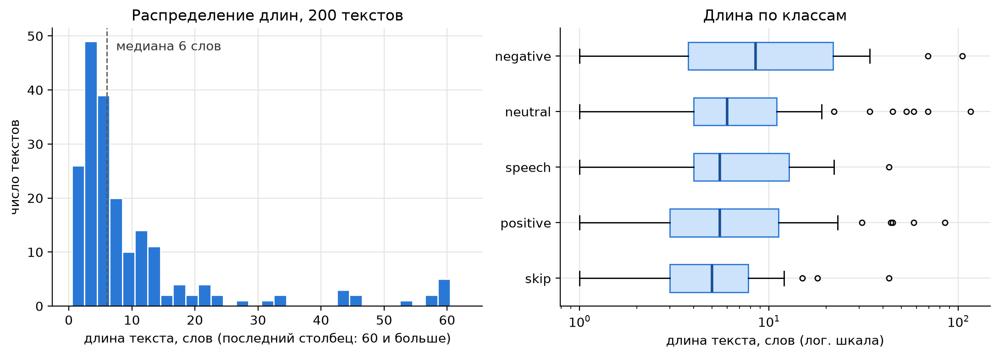
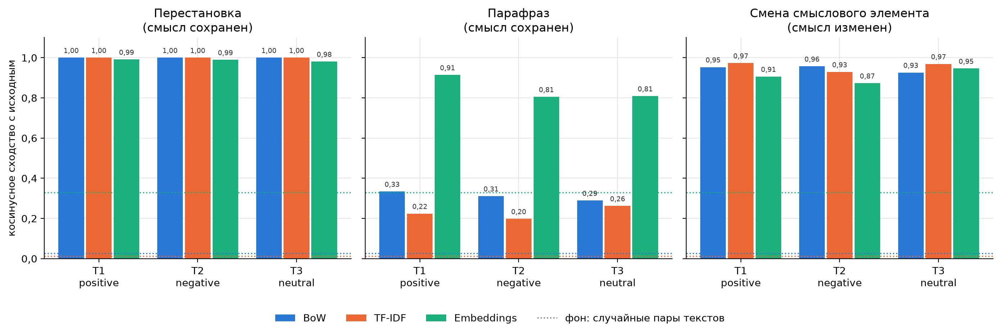

# Лабораторная работа №1. Один текст, разные представления

Курс: Автоматическая обработка текстов
Соболь Владимир Вячеславович, группа К3440, ИСУ 409594

## 1. Данные

RuSentiment состоит из постов ВКонтакте с метками тональности. В репозитории text-machine-lab/rusentiment данных больше нет, их убрали по просьбе ВКонтакте. Файл случайных постов `rusentiment_random_posts.csv` (21 268 текстов) я взял из форка strawberrypie/rusentiment. В нем только столбцы label и text, поэтому версию с id, text, label я собрал сам: 200 случайных текстов с seed 42, id равен номеру строки в исходном файле. Notebook сам скачивает файл и строит выборку.

Пропусков и пустых текстов нет, дубликатов в выборке тоже нет (в полном файле 74 повтора, в выборку они не попали). Классы: neutral 80, positive 44, skip 30, speech 26, negative 20, доли почти как в полном файле. Класс skip я оставил, чтобы выборка была случайной.

Тексты короткие: медиана 6 слов (36 символов), среднее 11 слов, максимум 116. Три четверти текстов не длиннее 11 слов, у распределения длинный правый хвост (рис. 1). Самые длинные посты в классе negative, медиана 8,5 слова.

## 2. Представления

1. Поверхностные признаки: 10 чисел на текст (длина в символах, словах и предложениях, средняя длина слова, доля заглавных букв, пунктуация, знаки ! и ?, скобки и эмодзи, упоминания, наличие отрицания).
2. Bag-of-words: CountVectorizer.
3. TF-IDF: TfidfVectorizer.
4. Sentence embeddings: paraphrase-multilingual-MiniLM-L12-v2 из sentence-transformers, 384 измерения.

Токенизатор для BoW и TF-IDF общий: razdel, нижний регистр, пунктуация и смайлы отбрасываются. Словарь из 1331 слова построен по 200 текстам вместе с девятью вариантами. Без вариантов новые слова парафраза выпали бы из словаря, и сходство вышло бы завышенным.

Для масштаба я посчитал среднее сходство всех пар разных текстов выборки: BoW 0,026, TF-IDF 0,012, эмбеддинги 0,329. У эмбеддингов даже случайные тексты заметно похожи, но выше 0,71 лежит только 1% пар.

## 3. Преобразования и ручная оценка

Три текста разных классов:

- T1, positive (id 4462): «Подруга. Я не знаю как ты меня терпишь. Но спасибо тебе.»
- T2, negative (id 1290): «ужасно, когда привязываешься к человеку и, как больной, ждешь от него звонка или сообщения, а ему там и без тебя хорошо.»
- T3, neutral (id 4680): «Памятник Илье Муромцу открыли во Владивостоке»

Смысловой элемент я менял по-разному: в T1 удалил отрицание, в T2 заменил оценочное слово антонимом, в T3 добавил отрицание. Изменился ли смысл, я решил до расчета сходства.

Таблица 1. Девять сравнений, косинусное сходство с исходным текстом

| Текст | Преобразование | Измененный текст | Смысл изменился | BoW | TF-IDF | Emb. |
|---|---|---|---|---|---|---|
| T1 | перестановка предложений | Я не знаю как ты меня терпишь. Но спасибо тебе. Подруга. | нет | 1,000 | 1,000 | 0,991 |
| T1 | парафраз | Подружка, ума не приложу, как ты меня выносишь. И все же благодарю тебя. | нет | 0,334 | 0,224 | 0,914 |
| T1 | удаление отрицания | Подруга. Я знаю как ты меня терпишь. Но спасибо тебе. | да | 0,953 | 0,973 | 0,906 |
| T2 | перестановка слов | ужасно, когда к человеку привязываешься и ждешь, как больной, от него сообщения или звонка, а ему и без тебя там хорошо. | нет | 1,000 | 1,000 | 0,989 |
| T2 | парафраз | Невыносимо, если прикипел к кому-то и изводишься в ожидании, пока он позвонит или напишет, а он спокойно обходится без тебя. | нет | 0,311 | 0,198 | 0,805 |
| T2 | замена «ужасно» на «прекрасно» | прекрасно, когда привязываешься к человеку и, как больной, ждешь от него звонка или сообщения, а ему там и без тебя хорошо. | да | 0,957 | 0,929 | 0,873 |
| T3 | перестановка слов | Во Владивостоке открыли памятник Илье Муромцу | нет | 1,000 | 1,000 | 0,981 |
| T3 | парафраз | В столице Приморья установили монумент богатырю Илье Муромцу | нет | 0,289 | 0,262 | 0,809 |
| T3 | добавление отрицания | Памятник Илье Муромцу не открыли во Владивостоке | да | 0,926 | 0,969 | 0,946 |

Перестановки меняют только порядок, факты и оценка остаются. Парафразы сохраняют все части утверждения: обращение, самоиронию и благодарность в T1, безответную привязанность и негативную оценку в T2, событие и место в T3 («столица Приморья» и есть Владивосток).

Без отрицания в T1 автор уже не признает, что его трудно выносить, и союз «но» теряет опору. В T3 открытие не состоялось. В T2 текст буквально одобряет ситуацию. Ироничное прочтение возможно, но опоры для него в тексте нет, поэтому я засчитал смену смысла.

## 4. Визуализация сходства

## 5. Где числа не согласуются со смыслом

1. Парафраз T3. Смысл тот же, но BoW дает 0,29, TF-IDF 0,26. Общих слов всего два, «Илье Муромцу», а «столица Приморья» и «Владивосток» для мешка слов не связаны. В T1 и T2 то же самое: у парафраза от 0,20 до 0,33, он дальше от оригинала, чем любая смена смысла.
2. Удаление отрицания в T1. Смысл изменился, а TF-IDF дает 0,973, даже больше, чем BoW (0,953). Слово «не» встречается часто, его IDF 3,0 против 5,3 у «ужасно», и TF-IDF снижает его вес. Эмбеддинг дает 0,906, почти как парафразу (0,914).
3. Добавление отрицания в T3. Эмбеддинг дает 0,946, а верный парафраз того же текста только 0,809. Для модели текст с противоположным фактом ближе к оригиналу, чем пересказ. В T2 порядок такой же: антоним 0,873, парафраз 0,805.
4. Замена «ужасно» на «прекрасно» в T2. BoW дает 0,957: отличается одно слово из 21, и в длинном тексте оно весит мало.

Поверхностные признаки перестановку не замечают вовсе. Отрицание меняет длину на 3 символа, парафраз сильнее (в T3 с 45 до 60). Смену смысла ловит только флаг отрицания, заведенный заранее, а антоним в T2 он пропускает.

## 6. Вывод

| Представление | Что видит | Что игнорирует |
|---|---|---|
| Поверхностные признаки | длину, пунктуацию, регистр, заранее заданные маркеры | порядок слов, лексику, синонимию |
| BoW | набор слов и их частоты | порядок слов, синонимы, вес одного слова в длинном тексте |
| TF-IDF | то же, редкие слова весят больше частых | порядок, синонимы, частые слова, в том числе «не» |
| Embeddings | синонимию и пересказ (0,80 и выше при фоне 0,33), немного порядок слов | отрицание и антонимы (0,87 и выше) |

Косинусное сходство ни в одном представлении не измеряет смысл. BoW и TF-IDF считают совпадение слов: перестановка для них тот же текст, парафраз почти чужой. Эмбеддинги узнают пересказ, но отрицание и замену оценки почти не замечают, в двух случаях из трех смена смысла оказалась ближе к оригиналу, чем парафраз. Для анализа тональности это существенно, метка зависит как раз от слов вроде «не» и «ужасно». Ограничения: три текста, одна модель эмбеддингов, смысл оценивал один человек.
