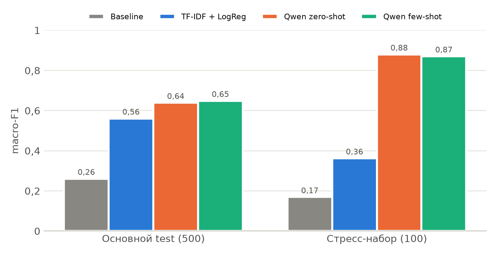
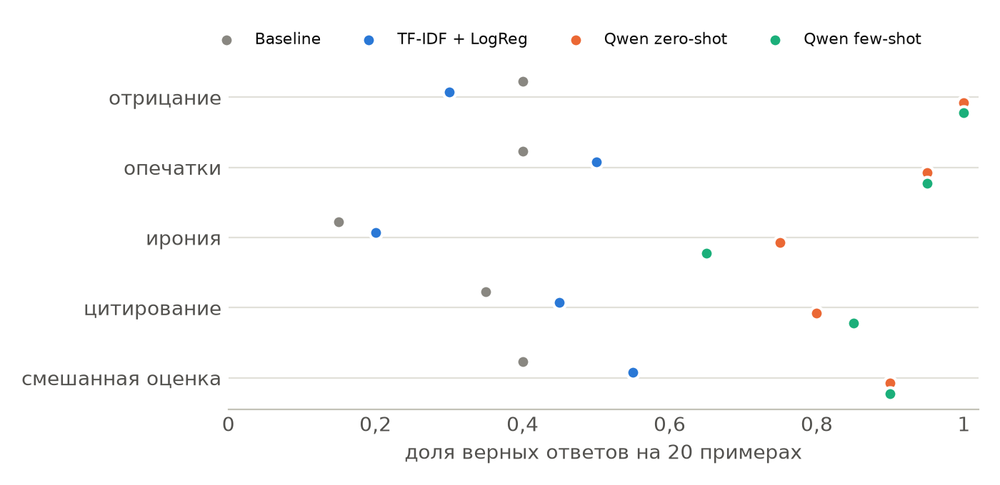
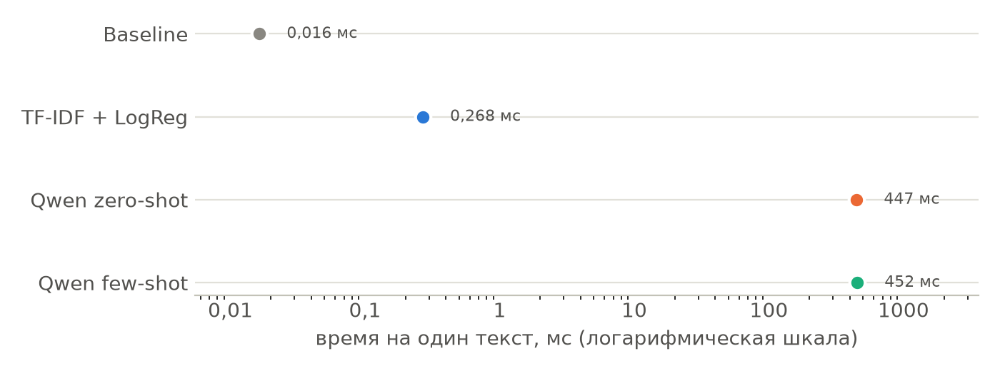

# Лабораторная работа №3. Классика против LLM

Курс: Автоматическая обработка текстов
Группа К3440: Соболь Владимир Вячеславович (409594)

## 1. Данные

Подготовленной версии RuSentiment на 3 000, 500 и 500 объектов в открытом доступе нет, поэтому я собрал аналог из исходных файлов корпуса (зеркало на GitHub, репозиторий strawberrypie/rusentiment). Оставлены классы positive, negative и neutral, классы speech и skip убраны. Train и validation взяты из `rusentiment_random_posts.csv`, где лежат случайные посты с естественным распределением классов. Test взят из официального `rusentiment_test.csv`. Выборка стратифицированная, seed 42. Из пула train удалены дубли и тексты, которые есть в test. Тексты приведены к одному написанию буквы е, длинные тире заменены на дефис.

| Выборка | positive | negative | neutral | Всего |
|---|---|---|---|---|
| train | 913 | 453 | 1 634 | 3 000 |
| validation | 152 | 76 | 272 | 500 |
| test | 121 | 58 | 321 | 500 |
| стресс-набор | 33 | 33 | 34 | 100 |

В test 64% нейтральных постов, поэтому accuracy мало говорит о качестве. Основная метрика дальше macro-F1.

**Стресс-набор.** 100 синтетических постов в стиле ВКонтакте, по 20 на явление: отрицание, опечатки, ирония, цитирование или пересказ чужой оценки, смешанная оценка. Тексты сгенерировала модель Claude Opus 5.5. Я специально взял другую LLM, чтобы Qwen не проверялась на собственных текстах. Метку генератор ставил вместе с коротким пояснением, все 100 меток я проверил вручную и оставил без изменений. Правило разметки: учитывается позиция самого автора, ирония размечается по реальному смыслу, при смешанной оценке берется преобладающая, при равновесии ставится neutral.

| Явление | Пример | Метка |
|---|---|---|
| отрицание | Нельзя сказать, что концерт не удался, наоборот, давно так не отрывался | positive |
| опечатки | ниче так пицерия, тесто тонкое, начинки многа, рикамендую | positive |
| ирония | Обожаю наше ЖКХ: третий день без горячей воды, зато квитанция пришла минута в минуту. Спасибо огромное! | negative |
| цитирование | Продавец клялся: отличный пылесос, прослужит сто лет. Сломался через месяц | negative |
| смешанная оценка | Новая форма у сборной: цвет отличный, а крой ужасный. Так на так | neutral |

## 2. Методы

**Baseline.** `DummyClassifier(strategy="most_frequent")`, всегда отвечает neutral.

**TF-IDF + LogisticRegression.** Pipeline из `TfidfVectorizer(ngram_range=(1, 2))` и `LogisticRegression(max_iter=2000)`, остальные параметры по умолчанию. На validation менялись два гиперпараметра: C от 0,3 до 10 000 и class_weight (None или balanced), всего 20 комбинаций, критерий macro-F1. Лучшая комбинация C = 1 000, class_weight = balanced, macro-F1 на validation 0,576. С balanced при C от 10 до 10 000 macro-F1 держится в пределах 0,56-0,58, так что выбор C почти не влияет на результат. Вес классов влияет сильнее, чем C. При C от 10 и выше без balanced F1 для negative ниже на 0,04-0,07. Итоговая модель обучена на train за 0,3 с.

**LLM.** qwen2.5:7b (7,6 млрд параметров, квантизация Q4_K_M) в Ollama 0.34.4 на Apple M1 Pro с 16 ГБ памяти. Запрос идет в `/api/chat` с `"format": "json"`, temperature 0, seed 42, num_ctx 8192. Ответ проверяет Pydantic-модель с полем `label: Literal["positive", "negative", "neutral"]`. На случай невалидного ответа в коде есть замена на neutral, но она не понадобилась, потому что все 1 200 ответов прошли проверку.

Zero-shot промпт состоит из системного сообщения и текста поста. В системном сообщении даны определения трех классов, три правила (оценивать позицию автора, а не чужие слова, которые он цитирует; иронию понимать по смыслу; при смешанной оценке брать преобладающую) и обязательный формат `{"label": "positive | negative | neutral"}`. Правила повторяют принцип разметки стресс-набора и RuSentiment: тональность определяется по позиции автора. Классическая модель узнает о нем только из меток train.

Few-shot промпт тот же, к нему добавлены шесть пар «пользователь, ассистент» из train, по два примера на класс, классы чередуются. Примеры я выбрал вручную из случайных постов train длиной 25-110 символов. Требования к ним: однозначная метка и отсутствие мата.

| Класс | Пример из train |
|---|---|
| positive | Для наших деток,классная колыбельная!))) |
| negative | Отпуск закончился😢 @ Раздольное |
| neutral | Добрался до Москвы.Утром выезжаю в НиНо. |
| positive | Вот это я понимаю, реконструктор чувак! :)) |
| negative | Никогда не думал, что будет так тяжело расставаться. Впереди еще 8 месяцев.. |
| neutral | есть желающие покататься завтра на воздушном шаре недорого? |

**Время.** Для классических методов я замерил время предсказания 500 текстов test одним пакетом (лучшее из пяти повторов) и по одному тексту в цикле. Для LLM запросы шли последовательно, время я мерил через `time.perf_counter` и вычитал загрузку модели (`load_duration`). В первом прогоне часть запросов zero-shot на test ждала в очереди Ollama, потому что той же моделью параллельно пользовалась другая программа. Эти замеры я повторил на свободной машине. Все ответы при повторе совпали с первым прогоном, максимальное ожидание в очереди в итоговых данных 23 мс.

**Токены.** Входные токены посчитаны токенизатором Qwen2.5 из transformers (`Qwen/Qwen2.5-7B-Instruct`, `apply_chat_template` с шаблоном чата). Выходные токены: токены ответа плюс завершающий токен. Во всех 1 200 запросах оба числа совпали с `prompt_eval_count` и `eval_count` из ответа Ollama.

## 3. Качество

| Метод | test accuracy | test macro-F1 [95% ДИ] | стресс accuracy | стресс macro-F1 |
|---|---|---|---|---|
| Baseline | 0,642 | 0,261 [0,250-0,271] | 0,340 | 0,169 |
| TF-IDF + LogReg | 0,660 | 0,561 [0,513-0,608] | 0,400 | 0,362 |
| Qwen zero-shot | 0,646 | 0,639 [0,591-0,681] | 0,880 | 0,880 |
| Qwen few-shot | 0,662 | 0,649 [0,600-0,688] | 0,870 | 0,870 |

Доверительные интервалы получены бутстрепом по 1 000 выборкам.

На test обе версии LLM лучше TF-IDF по macro-F1. Парный бутстреп дает разницу few-shot и TF-IDF +0,088 (95% ДИ 0,025-0,148), zero-shot и TF-IDF +0,079 (0,018-0,140). Few-shot лучше zero-shot всего на 0,010 (от -0,018 до 0,041), эта разница незначима.

По accuracy методы почти не различаются (0,646-0,662). Причина видна по классам. F1 для negative у TF-IDF 0,36, у LLM 0,59-0,62. LLM находит почти все негативные посты (few-shot 56 из 58) и 104 из 121 позитивного. Зато 150 из 321 нейтрального поста few-shot относит к positive или negative, отсюда F1 neutral 0,68 против 0,75 у TF-IDF. В RuSentiment нейтральными размечены многие шутки, посты со смайликами, цитаты и новости о плохих событиях. Модель видит в них эмоцию. TF-IDF усваивает эту договоренность разметчиков из train.

## 4. Устойчивость

| Явление (по 20 примеров) | Baseline | TF-IDF | zero-shot | few-shot |
|---|---|---|---|---|
| отрицание | 0,40 | 0,30 | 1,00 | 1,00 |
| опечатки | 0,40 | 0,50 | 0,95 | 0,95 |
| ирония | 0,15 | 0,20 | 0,75 | 0,65 |
| цитирование | 0,35 | 0,45 | 0,80 | 0,85 |
| смешанная оценка | 0,40 | 0,55 | 0,90 | 0,90 |

В таблице доля верных ответов.

На стресс-наборе macro-F1 у TF-IDF падает с 0,561 до 0,362. Дело не в словаре: доля слов вне словаря модели на test и стресс-наборе почти одинакова (30% и 29%). Мешает устройство текстов. На отрицании TF-IDF хуже baseline, потому что у токена «не» один из самых больших весов в пользу negative. Из семи позитивных примеров с отрицанием («совсем не плохой», «не могу не радоваться») модель не угадала ни одного, четыре ушли в negative. В иронии и цитатах модель видит только оценочные слова и не может понять, кому оценка принадлежит.

У LLM на стресс-наборе результат выше, чем на test (0,87-0,88). Это не значит, что сложные тексты ей проще. Синтетические посты заведомо однозначны для человека и размечены по тем же правилам, что даны в промпте, а в test много спорных меток. Хуже всего LLM справляется с иронией. Особенно трудна положительная самоирония («Кошмар, меня опять вынудили две недели валяться на море»): из пяти таких примеров оба режима ошиблись в трех. Few-shot на иронии хуже zero-shot (0,65 против 0,75). Примеры в промпте буквальные, и модель, видимо, стала больше доверять словам.

## 5. Время и стоимость

| Метод | мс на текст | токенов на входе | токенов на выходе | токенов на 1 000 текстов (вход / выход) | время на 1 000 текстов | стоимость 1 000 текстов |
|---|---|---|---|---|---|---|
| Baseline | 0,016 | - | - | - | < 0,1 с | 0 |
| TF-IDF + LogReg | 0,27 (пакетом 0,008) | - | - | - | 0,27 с | 0 |
| Qwen zero-shot | 447 | 338,2 | 7 | 338 174 / 7 000 | 7,4 мин | 0 |
| Qwen few-shot | 452 | 564,2 | 7 | 564 174 / 7 000 | 7,5 мин | 0 |

Время указано для обработки по одному тексту на test.

LLM медленнее TF-IDF примерно в 1 700 раз при обработке по одному тексту и в 55 000 раз при пакетной. Вход few-shot длиннее на 67%, а время выросло всего на 1%. Ollama хранит KV-кэш общего префикса (системное сообщение и примеры) и для каждого запроса заново считает только токены нового текста, поэтому время обработки промпта у few-shot 0,209 с, а у zero-shot 0,207 с. При этом `prompt_eval_count` показывает полную длину входа, и платный API тоже берет плату за весь вход. Ответ всегда занимает 7 токенов.

Модель работает локально, за запросы никто не берет денег, поэтому стоимость равна нулю. Тратятся только время и электричество. Для платного API стоимость 1 000 текстов считается как (338 174 × p_in + 7 000 × p_out) / 10^6 для zero-shot и (564 174 × p_in + 7 000 × p_out) / 10^6 для few-shot, где p_in и p_out это цены за миллион входных и выходных токенов. Основную часть счета дает вход, поэтому без скидки на кэш few-shot обойдется примерно в 1,6-1,7 раза дороже.

## 6. Разбор 15 ошибок

Ошибки классического метода. TF-IDF ошибся, обе версии LLM ответили правильно.

| № | Текст | Эталон | TF-IDF | Причина |
|---|---|---|---|---|
| 1 | Как х\*\*во и тяжело на душе, когда тебя бросает твой любимый и дорогой человек...((( какая тоска и боль на душе, это не передать(((( | negative | neutral | Это слово в train не встречалось, скобки «(((» токенизатор по умолчанию отбрасывает. У слова «любимый» большой положительный вес (+6,0), он перевешивает «тяжело» и «боль». |
| 2 | Поймала грустинку...((( | negative | neutral | Оба слова вне словаря, скобки отброшены, вектор пустой. Модель отвечает классом по свободному члену. Таких пустых векторов в test 36. |
| 3 | Люди интересны друг другу настолько, насколько они друг другу полезны. (с) Максим Ильяхов | neutral | positive | Цитата без оценки автора. Положительный вес дают «друг» и «друг другу»: в train они часто стоят в теплых постах друзьям. |
| 4 | Нельзя сказать, что концерт не удался, наоборот, давно так не отрывался (стресс) | positive | negative | Двойное отрицание. «Не» и «нельзя» тянут в negative, а синтаксиса модель не видит. |
| 5 | Обожаю наше ЖКХ: третий день без горячей воды, зато квитанция пришла минута в минуту. Спасибо огромное! (стресс) | negative | positive | Ирония. «Обожаю» и «спасибо» имеют сильный положительный вес, а факт «третий день без горячей воды» для модели не оценка. |

Ошибки LLM. Во всех пяти примерах zero-shot ответил так же, как few-shot.

| № | Текст | Эталон | Few-shot | Причина |
|---|---|---|---|---|
| 6 | Все люди как люди, влюбляются в девушек, а я влюбился в свои новые наушники:) | neutral | positive | Шутка со смайликом. По разметке RuSentiment шутка без явной оценки нейтральна, модель считает веселый тон положительным. Это самый частый тип ошибки LLM на test, и часть таких эталонных меток спорна. |
| 7 | На прошении Шлимана вернуться в Россию император Александр II наложил резолюцию: «Пусть приезжает - повесим». | neutral | negative | Исторический анекдот. Модель оценивает событие в тексте (угрозу казнью), а не отношение автора. |
| 8 | Не делайте умное лицо,вам не идет (цэ) | neutral | negative | Цитата с пометкой «(цэ)». Правило промпта про чужие слова модель здесь не применила. |
| 9 | Кошмар, меня опять вынудили две недели валяться на море и ничего не делать. Бедный я, бедный) (стресс) | positive | negative | Положительная самоирония. Модель читает буквальные «кошмар» и «бедный». TF-IDF ошибся так же. |
| 10 | Прочитал, что критики назвали новый альбом группы гениальным и лучшим в карьере. Релиз в пятницу (стресс) | neutral | positive | Нейтральный пересказ чужой оценки. Модель переносит оценку критиков на автора. |

Расхождения классического метода и LLM. В скобках ответ zero-shot, если он отличается от few-shot.

| № | Текст | Эталон | TF-IDF | Few-shot | Разбор |
|---|---|---|---|---|---|
| 11 | скоро старый новый год! | neutral | positive | neutral (zero-shot positive) | В train «новый» и «год» стоят в поздравлениях и получили положительные веса. Few-shot прав, zero-shot ошибся так же, как TF-IDF. |
| 12 | Отель новый, чистый, с бассейном, персонал милый. Но за стенкой стройка с 7 утра, выспаться не удалось ни разу, отпуск испорчен (стресс) | negative | positive | negative | Смешанная оценка. TF-IDF видит положительное «милый», а «испорчен» и «стройка» вне словаря. LLM учитывает итоговый вывод автора. |
| 13 | "царя распни!"-кричал НАРОД,-"а лучше отпусти нам из темницы вора и разбойника Варраву"...этот библейский сюжет вам ничего не напоминает? | neutral | neutral | negative | Риторический вопрос с намеком на современность. Автор, скорее всего, критикует происходящее, и ответ LLM я считаю допустимым. TF-IDF прав формально: оценочных слов в тексте нет. |
| 14 | 10 часов( жалко что короткое XD | neutral | negative | positive | Смешанные сигналы. У TF-IDF в negative тянут «часов», «жалко» и даже «xd». LLM принимает XD за радость. Эталон тоже можно оспорить. |
| 15 | Ита шидвр! | positive | neutral | negative (zero-shot neutral) | Опечатки в реальных данных («это шедевр»). Для TF-IDF оба слова вне словаря. LLM слово не восстановила: в синтетических опечатках искажена часть слов, а здесь весь текст. |

Всего на test TF-IDF и few-shot расходятся в 242 постах из 500, оба ошибаются в 61. Ошибки TF-IDF связаны со словарем: неизвестные слова, отброшенные смайлики, отрицание и ирония, которые не видны по отдельным словам. У LLM другие ошибки: граница нейтрального класса в RuSentiment, оценка события вместо позиции автора, самоирония и пересказ чужого мнения. В примерах 6, 13 и 14 я считаю спорной саму эталонную метку.

## 7. Рекомендации

**Массовая обработка.** TF-IDF + LogisticRegression. 1 000 текстов обрабатываются за 0,27 с по одному и за 8 мс пакетом, у LLM на это уходит 7,5 минуты. Но macro-F1 у него на 0,09 ниже, и негатив он распознает плохо. Если негатив важен, LLM можно использовать для разметки дополнительных обучающих данных или для проверки постов, в которых классификатор не уверен.

**Небольшой поток сложных текстов.** LLM в режиме zero-shot. На стресс-наборе macro-F1 0,88 против 0,36 у TF-IDF. Few-shot не дает значимого прироста, на иронии он хуже, а вход у него в 1,7 раза длиннее. С самоиронией и нейтральным пересказом чужого мнения модель по-прежнему ошибается, поэтому такие тексты стоит проверять вручную или добавить в промпт примеры именно этих случаев.

**Локальная обработка без внешнего API.** qwen2.5:7b в Ollama работает на ноутбуке с M1 Pro и 16 ГБ памяти, 0,45 с на текст и около 7,5 минуты на 1 000 текстов. Данные остаются на машине, платить не нужно. Для большого локального потока разумно сначала прогонять TF-IDF, а LLM оставить для сложных случаев. Если ресурсов на LLM нет совсем, TF-IDF работает на обычном процессоре и обучается за доли секунды.

## 8. Выводы

На основном test обе версии LLM лучше TF-IDF по macro-F1 (0,64-0,65 против 0,56), разница значима. Сильнее всего LLM выигрывает на негативном классе. По accuracy выигрыша нет, потому что модель часто находит эмоцию там, где разметчики RuSentiment поставили neutral. На стресс-наборе разрыв большой (0,87-0,88 против 0,36). Классическая модель не справляется с отрицанием, иронией и цитатами, а LLM ошибается в основном на самоиронии и пересказе чужой оценки. Шесть примеров в few-shot почти ничего не добавили к zero-shot. Но LLM медленнее классической модели на три порядка при обработке по одному тексту: 0,45 с против 0,27 мс.
