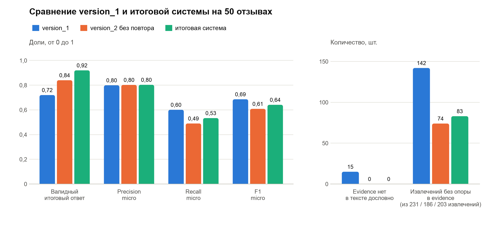

# Лабораторная работа №4. Промпт как программа

Курс: Автоматическая обработка текстов
Группа К3440: Соболь Владимир Вячеславович (409594)

## 1. Данные

Взят корпус RuDReC (github.com/cimm-kzn/RuDReC, файл `rudrec_annotated.json`): размеченная часть из 500 отзывов потребителей о лекарствах, сущности размечены внутри предложений. Предложения склеены обратно в отзывы. Из 475 отзывов длиной от 200 до 1200 символов случайно выбрано 50 (`random.Random(42)`, `make_data.py`). Средняя длина 719 символов. При подготовке е с двумя точками заменена на обычную е, длинные тире на дефис. Проверка evidence идет уже по очищенному тексту.

Эталон:

| Поле | Источник | Элементов | Отзывов с полем |
|---|---|---|---|
| drug | RuDReC, сущности Drugname | 91 | 43 |
| indication | RuDReC, сущности DI | 131 | 42 |
| adverse_reaction | RuDReC, сущности ADR | 83 | 20 |
| positive_effect | ручная разметка | 32 | 22 |

В RuDReC нет разметки положительного эффекта, поэтому это поле я разметил сам до запуска модели (`data/gold_positive_effect.csv`). Правило то же, что в version_2: улучшение, которое реально наступило у пациента; отрицаемый, ожидаемый и чужой эффект не считается. Если в отзыве есть конкретное улучшение, общее «помог» отдельно не записывается. Лекарственные формы (Drugform) и классы (Drugclass) RuDReC в эталон drug не входят.

## 2. Модель

Используется локальная qwen2.5:7b через Ollama (`/api/chat`, `"format": "json"`, temperature 0, seed 42, окно 8192 токена). Модель работает на моем компьютере и не тарифицируется, поэтому стоимость в отчете не считается, вместо нее приводятся токены и время. Токены берутся из полей ответа `prompt_eval_count` и `eval_count`.

Режим `"format": "json"` заставляет Ollama выдавать синтаксически корректный JSON. Поэтому разница между версиями видна не в разборе JSON, а в соответствии схеме и в evidence.

## 3. Промпты

**version_1** (`prompts/version_1.txt`): одна фраза с перечнем того, что извлечь, и пустой шаблон JSON. Примеров и определений полей нет.

**version_2** (`prompts/version_2.txt`):
- точное описание каждого поля и понятие пациента (автор или тот, кого он лечит в отзыве);
- правила для drug: название пишется как в тексте, даже с опечаткой; лекарственная форма, класс и слова «препарат», «средство» названием не считаются;
- правила отрицаний: отрицаемый эффект не извлекается, а отрицание самой болезни («за зиму ни разу не заболела») считается положительным эффектом;
- ожидаемый и предполагаемый эффект, реакции у других людей, перечни из инструкции не извлекаются;
- требование копировать evidence символ в символ;
- два размеченных примера. Первый: эффект, реакция и чужая реакция, которую брать не нужно. Второй: препарат без названия, надежда на эффект, отрицание эффекта и цитата из инструкции.

Version_2 менялась один раз по результату тестов. На тесте «препарат не указан» модель записывала в drug слово «таблетки», хотя правило уже было. Помогли две правки: пример 2 переписан под препарат без названия, а правило дополнено фразой «если названия нет, drug это пустой список». В той же правке уточнено правило для общего «помог»: его пишут, только если конкретного улучшения в отзыве нет. После этого все тесты прошли, и только потом система была запущена на 50 отзывах.

## 4. Схема и проверки

Схема ответа описана в `schema.py` классом `Extraction` (Pydantic 2):
- пять обязательных полей, каждое `list[str]`;
- `extra="forbid"`: лишнее поле делает ответ невалидным;
- `strict=True`: строка вместо списка или число вместо строки не приводятся к нужному типу, а дают ошибку;
- пустые строки в списках запрещены.

Проверка ответа (`extractor.check`) идет в три шага:
1. ответ разбирается как JSON-объект;
2. объект проходит схему `Extraction`;
3. каждый элемент evidence найден в тексте отзыва, и если хотя бы одно поле заполнено, evidence не пустой. Слова и знаки должны совпасть полностью, но регистр не учитывается, а любая цепочка пробелов и переносов строк считается одним пробелом. Найденный фрагмент заменяется точной подстрокой исходного текста, поэтому в итоговом ответе evidence всегда совпадает с текстом символ в символ.

Сначала проверка была строгой (`ev in text`). В таком прогоне с первой попытки не прошел 21 ответ из 50, и в 13 из них причина была только в регистре первой буквы или в переносе строки, который модель заменила пробелом. Например, в тексте «доктор выписал Назоферон.», а в evidence «Доктор выписал Назоферон.». После повтора отклонялось 9 отзывов, из них 5 по той же причине. Такие фрагменты дословно повторяют текст, поэтому я смягчил проверку только для регистра и пробелов, а итоговую систему прогнал заново. Строгий прогон сохранен (`results/raw_final_strict.jsonl`, `results/metrics_strict.md`): 82% валидных ответов и F1 0,606.

Ошибки собираются в список понятных фраз: «лишнее поле "confidence"», «фрагмента evidence "..." нет в тексте отзыва дословно».

**Повторный запрос.** Если первая попытка не прошла проверку, `Extractor` добавляет в диалог ответ модели и сообщение со списком ошибок и просьбой вернуть исправленный JSON. Повтор разрешен ровно один, это проверяет тест 10. Если второй ответ тоже невалиден, система возвращает пустой результат со статусом `rejected`: неподтвержденные данные наружу не выходят. Статусы: `valid` (прошел с первого раза), `fixed_by_retry`, `rejected`, `empty_text` (пустой текст, модель не вызывается). Все попытки, сырые ответы, ошибки, токены и время пишутся в `results/raw_*.jsonl`, итог в `results/results.csv`.

## 5. Тесты

В `tests/test_extractor.py` 16 тестов, все проходят (`pytest -q`: 16 passed). Тесты 2-8 вызывают настоящую модель с итоговой системой, тесты 1, 9, 10 используют подставной клиент с заданными ответами, потому что настоящая модель не выдает лишнее поле или выдуманный evidence по заказу.

| № | Случай | Что проверяет тест |
|---|---|---|
| 1 | пустой текст | модель не вызывается, результат пустой, статус empty_text |
| 2 | препарат не указан | «таблетки от кашля» без названия: drug пустой |
| 3 | несколько препаратов | в drug есть Терафлю, Арбидол и Мирамистин |
| 4 | эффект отрицается | «спать лучше не стала»: positive_effect пустой |
| 5 | эффект предполагается | «надеюсь, судороги скоро пройдут»: positive_effect пустой |
| 6 | реакция у другого человека | боль в животе у сестры: adverse_reaction пустой |
| 7 | цитата | побочные эффекты из цитаты инструкции не извлечены, evidence дословный |
| 8 | ошибка в названии | в drug записано «Орбидол», как в тексте |
| 9 | лишнее поле | первый ответ с полем confidence; в повторном запросе названо это поле; второй ответ принят |
| 10 | evidence нет в тексте | выдуманный evidence дважды: ровно один повтор, затем отказ и пустой результат |

Еще шесть тестов проверяют схему и проверку отдельно: лишнее поле, пропуск поля и строку вместо списка, битый JSON, поиск evidence при другом регистре и переносе строки, отказ для пересказанного evidence, прохождение валидного ответа без повтора.

## 6. Сравнение version_1 и итоговой системы

Обе системы прогнаны на 50 отзывах (`run.py`), метрики считает `evaluate.py`. Столбец «version_2 без повтора» взят из того же прогона итоговой системы: это ее первая попытка, где невалидный ответ сразу отклоняется. По нему видно, что дает повторный запрос.

**Как считается качество.** Элементы ответа и эталона приводятся к нижнему регистру, служебные слова убираются, каждое слово обрезается до первых четырех букв. Элемент модели совпадает с элементом эталона, если общих основ хотя бы половина от числа основ в более коротком из них («сыпь на руках» и «сыпью покрылся» совпадают). Сопоставление идет один к одному внутри отзыва, по четырем полям считаются precision, recall и F1, итог micro по всем полям. Evidence с эталоном не сравнивается. Ответы version_1 оцениваются как есть, даже если они не прошли проверку, потому что в version_1 проверки нет. Отклоненный ответ итоговой системы считается пустым.

**Неподтвержденные результаты** считаются двумя способами: фрагменты evidence, которых нет в тексте, и извлечения, для которых нет подходящего фрагмента в evidence (не меньше половины основ элемента должно быть в одном найденном фрагменте).

| Метрика | version_1 | version_2 без повтора | итоговая система |
|---|---|---|---|
| Ответ разбирается как JSON | 100% | 100% | 100% |
| Проходит схему Pydantic | 98% | 100% | 100% |
| Проходит все проверки с первой попытки | 72% | 84% | 84% |
| Валидный итоговый ответ | 72% | 84% | 92% |
| Повторов / исправлено / отклонено | нет | нет / нет / 8 | 8 / 4 / 4 |
| Precision micro | 0,799 | 0,802 | 0,803 |
| Recall micro | 0,601 | 0,490 | 0,534 |
| F1 micro | 0,686 | 0,608 | 0,641 |
| F1 drug | 0,814 | 0,677 | 0,727 |
| F1 indication | 0,613 | 0,554 | 0,605 |
| F1 positive_effect | 0,667 | 0,667 | 0,700 |
| F1 adverse_reaction | 0,657 | 0,585 | 0,576 |
| Evidence нет в тексте | 15 из 124 | 0 из 102 | 0 из 109 |
| Извлечения без опоры в evidence | 142 из 231 (61%) | 74 из 186 (40%) | 83 из 203 (41%) |
| Токенов на отзыв, вход / выход | 349 / 142 | 1393 / 113 | 1650 / 133 |
| Секунд на отзыв | 8,0 | 6,5 | 7,5 |

**Валидность.** Режим `"format": "json"` дает синтаксически правильный JSON во всех 150 ответах, так что разбор JSON системы не различает. Схему не прошел один ответ version_1: evidence пришел строкой вместо списка. Больше всего брака дает evidence. В version_1 15 фрагментов из 124 не найдены в тексте: модель пересказывает, склеивает куски разных предложений, исправляет опечатки автора. Из-за этого 14 ответов из 50 невалидны. В version_2 с первой попытки невалидны 8 ответов, повторный запрос исправил 4, еще 4 отклонены. В итоге 92% валидных ответов против 72% и ни одного неподтвержденного evidence против 15.

**Качество извлечения.** Precision у всех систем около 0,80, recall у итоговой системы ниже (0,534 против 0,601). Если оставить только 46 отзывов, которые итоговая система не отклонила, F1 почти одинаковый: 0,678 у итоговой системы и 0,685 у version_1. Значит, итоговая система теряет качество в основном на четырех отклоненных отзывах, потому что из-за одного неверного фрагмента выбрасывается весь ответ. По полям правила version_2 заметнее всего сработали на positive_effect: precision выросла с 0,65 до 0,75 (7 лишних элементов вместо 12). Version_1 часто записывала в эффект свойства препарата: «быстрое растворение», «пропивать их удобно», «хорошо переносится», «считается безопасным средством». В version_2 это прямо запрещено, и таких ошибок стало меньше. Recall упал у drug (с 0,74 до 0,62) и adverse_reaction (с 0,59 до 0,48), потому что version_2 осторожнее и чаще пропускает препараты, которые упомянуты попутно, и спорные реакции (разбор в разделе 7).

**Неподтвержденные результаты.** Недословных evidence в итоговой системе нет, так устроена проверка. Доля извлечений без опоры в evidence снизилась с 61% до 41%, но осталась большой. Для реакций и эффектов модель почти всегда дает фрагмент (без опоры 5 из 55 реакций и 7 из 29 эффектов), а для показаний и препаратов часто нет (46 из 63 и 25 из 56). Зато выдуманных элементов почти нет: только 3 извлечения в каждой системе не находятся в самом тексте. Проверку «у каждого элемента есть свой фрагмент» в итоговую систему я не включал, потому что она сопоставляет слова приближенно и давала бы лишние отказы. Это следующий шаг.

**Затраты.** Итоговая система тратит в 4,7 раза больше входных токенов (1650 против 349 на отзыв), потому что промпт длинный, с примерами, и есть повторные запросы. По времени разницы почти нет, 7,5 против 8,0 секунды, потому что version_1 пишет более длинные ответы. Весь прогон итоговой системы занял 6 минут и 89 тысяч токенов.

## 7. Анализ пяти ошибок

Ошибки взяты из ответов итоговой системы (`results/scored.csv`, `system == "final"`) и сверены с текстом отзыва и сырыми ответами модели в `results/raw_final.jsonl`.

| № | id | Поле | Тип ошибки | Чья ошибка |
|---|---|---|---|---|
| 1 | 2538754 | evidence, весь ответ | отказ после повтора: модель исправила опечатку в цитате | модель и проверка |
| 2 | 2703065 | drug | класс средства вместо названия | модель |
| 3 | 255563 | drug | пропуск препаратов, упомянутых попутно | модель |
| 4 | 2497493 | adverse_reaction | в эталоне реакцией названа неэффективность | эталон |
| 5 | 884467 | positive_effect | эффект у родственников, а не у пациента | модель |

### Ошибка 1. Отказ после повтора (2538754)

В тексте: «пропала раздрожительность, плаксивость, стала ко всему относится спокойней». В evidence модель написала «относиться», то есть исправила ошибку автора, а опечатку «раздрожительность» оставила. По сообщению повтора не видно, где расхождение. Во второй попытке фрагмент стал длиннее, но «относиться» осталось, и ответ отклонен. Пропали шесть элементов первой попытки, совпавших с эталоном: Афобазол, три показания и два положительных эффекта. Остальные три отказа такие же: «эффект» стал «эффекта» (806166), «хочется» стало «хотется» (1326637), «темп» стал «температура» (6275749), а фраза «температура больше не поднималась» взята из правил промпта. Нужно в коде искать ближайший фрагмент текста с разницей в пару символов и подставлять его, а при отказе убирать только элементы без опоры.

### Ошибка 2. Класс средства в drug (2703065)

Название препарата в отзыве не указано: «купила в аптеке этот противовирусный препарат». Модель записала в drug «противовирусный препарат» и привела этот же фрагмент в evidence, поэтому проверка ответ пропустила. В эталоне в drug только «Ринзу Сип», упомянутая для сравнения («Лучше уж просто пить Ринзу Сип»), и ее модель не взяла. Похоже, модель старается заполнить drug тем, о чем написан отзыв. Правило про классы и второй пример в промпте не помогли: у version_1 таких ложных срабатываний было четыре, а у итоговой системы шесть из семи ложных элементов drug вообще не названия. Это классы и формы («противовирусное средство», «таблетки», «препарат») и даже показание «от боли в горле». Надежнее чистить drug в коде: удалять элементы, которые состоят только из названий форм, классов и общих слов.

### Ошибка 3. Пропуск препаратов из перечня (255563)

Отзыв про Ликопид, но в начале автор пишет: «Перепробовали очень много иммуномодуляторов: интерферон, ануферон, афлубин, арбидол». Модель вернула в drug только «Ликопид», в эталоне RuDReC пять названий. Ребенок эти препараты принимал, так что это пропуск модели. Видимо, модель выделяет главный препарат отзыва, а перечень считает фоном: в обоих примерах промпта по одному препарату, и правило не требует брать все. А в 2702457 похожий список из шести препаратов извлечен полностью. В принятых ответах 21 из 23 пропусков по drug такого же рода: попутные упоминания (Тамифлю, Реленза, валерьянка, пустырник) и компоненты состава. В промпт нужно добавить «перечисли все названия, в том числе из списков, сравнений и состава» и пример с перечнем.

### Ошибка 4. Неэффективность как нежелательная реакция в эталоне (2497493)

Таблетки давали ребенку для профилактики: «сегодня 4 день ребенок проснулся с температурой и соплями. Вывод: при профилактике бесполезен вообще». В эталоне RuDReC температура и сопли размечены как ADR, модель оставила adverse_reaction пустым. Здесь скорее права модель: это не побочное действие, а болезнь, от которой препарат не защитил. Эталон к тому же непоследователен: в 644737 похожий случай («на четвертый день у нас появилась температура и кашель») размечен как показание, а модель записала туда ADR и получила два ложных срабатывания. В промпт нужно добавить правило, что болезнь, которая началась или не прошла во время приема, это отсутствие эффекта, а не adverse_reaction, и поправить такие случаи в эталоне.

### Ошибка 5. Чужой опыт в positive_effect (884467)

Автор пересказывает опыт семьи сестры: «Уже месяц всей семьей мажутся, и пока никто из них не болел», а про себя пишет «у нас пока необходимости нет». Модель записала в positive_effect «никто из семьи не болел», в ручном эталоне поле пустое. Фраза похожа на правило промпта «отрицание самой болезни после приема это положительный эффект». В определении пациента названы родственники (ребенок, мама, муж), а в запрете на чужой опыт только подруга и знакомые. В значении пропали слова «из них» и «пока», и по полю не видно, что речь о других людях. В промпт нужно добавить: пациент только тот, кто лечился сам или кого лечил автор, пересказ опыта родни не считается.

### Итог по ошибкам

Больше всего система теряет на строгом отказе по evidence и на границе поля drug: четыре отклонения обнулили 19 элементов первых попыток, совпадавших с эталоном, а в drug шесть из семи ложных срабатываний и 21 из 23 пропусков в принятых ответах связаны с тем, что считать названием. Эти ошибки проще закрыть в коде (нестрогий поиск evidence, фильтр классов и форм) и примерами в промпте, чем новыми общими правилами. По adverse_reaction заметная часть расхождений идет от эталона: кроме 2497493, он явно ошибается в 275243, 2439706, 2538754 и 3188437, поэтому F1 0,576 по этому полю занижен.

## 8. Выводы

1. Схема, проверка и один повторный запрос делают ответы модели предсказуемыми. Итоговая система дает 92% валидных ответов и ни одного evidence, которого нет в тексте. У version_1 без проверок 72% валидных ответов и 15 недословных фрагментов.
2. Режим JSON в Ollama решает только синтаксис. Схема ловит редкие ошибки типа, а основная работа проверки приходится на evidence: модель пересказывает текст, склеивает фрагменты и исправляет опечатки автора.
3. Повторный запрос с описанием ошибки исправил 4 ответа из 8. В остальных модель снова переписала фрагмент по-своему. Скорее всего, ей не хватает указания, какое именно слово не совпало с текстом.
4. Качество извлечения на принятых отзывах почти не изменилось (F1 0,678 против 0,685 у version_1). Общий F1 итоговой системы ниже (0,641 против 0,686) из-за отказов: система выбрасывает весь ответ, если хотя бы один фрагмент не подтвержден. Это плата за то, что неподтвержденных данных в ответах нет. Мягче было бы убирать только неподтвержденные фрагменты и элементы, которые на них опираются.
5. Тесты работают как спецификация промпта: тест «препарат не указан» нашел ошибку еще до прогона на данных, и после него поменялся промпт.
6. Что улучшить дальше: нестрогий поиск evidence с подстановкой ближайшего фрагмента, фильтр классов и форм в drug, правило и пример для перечней препаратов, проверка, что у каждого элемента есть свой фрагмент.

Ограничения: эталон positive_effect размечен одним человеком; в эталоне RuDReC по adverse_reaction есть спорные случаи; сопоставление по основам слов приближенное. Тесты с настоящей моделью зависят от ее версии, поэтому стоят temperature 0 и фиксированный seed.

## 9. Приложенные файлы

| Что сдается | Файл |
|---|---|
| version_1 и version_2 промпта | `ЛР4_К3440_Соболь_промпт_version_1.txt`, `ЛР4_К3440_Соболь_промпт_version_2.txt` (в проекте `prompts/`) |
| Pydantic-схема | `ЛР4_К3440_Соболь_схема.py` (в проекте `schema.py`) |
| pytest-тесты | `ЛР4_К3440_Соболь_тесты.py` (в проекте `tests/test_extractor.py`, нужны `schema.py`, `extractor.py`, `llm.py`) |
| результаты | `ЛР4_К3440_Соболь_результаты.csv` и та же таблица в `.xlsx` |
| отчет с анализом пяти ошибок | этот документ, раздел 7 |

В таблице результатов по строке на отзыв и систему (version_1 и итоговая система, всего 100 строк): статус, ошибки первой и второй попытки, пять полей ответа, число недословных evidence и извлечений без опоры, токены и время, эталон и текст отзыва.
